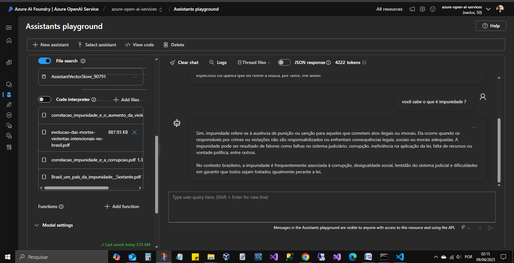
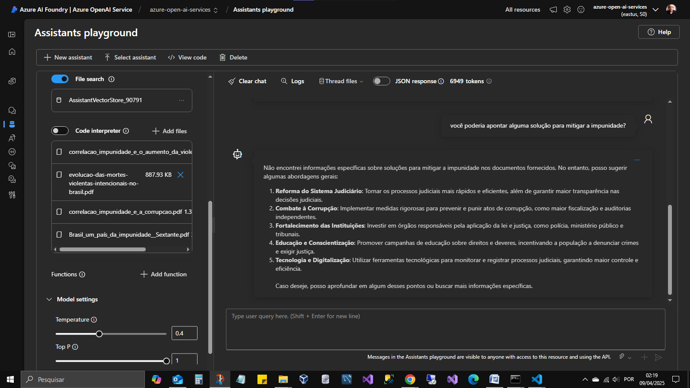

# Agente de Pesquisa Personalizado : Azure AI Foundry | Azure OpenAI Service

Criação de um sistema(Agente de IA) para pesquisar assunto especifico.

## Sobre

Agente para pesquisa do tema a impunidade e sua causa, como podemos evitar.

## Estrutura do Projeto

```
.
│   agent-01.png
│   agent-02.png
│   LICENSE
│   README.md
│
└───inputs
        Brasil_um_país_da_impunidade__Sextante.pdf
        correlacao_impunidade_e_a_corrupcao.pdf
        correlacao_impunidade_e_o_aumento_da_violencia.pdf
        evolucao-das-mortes-violentas-intencionais-no-brasil.pdf
```

## Implantações

- Assistants playground

  

  
